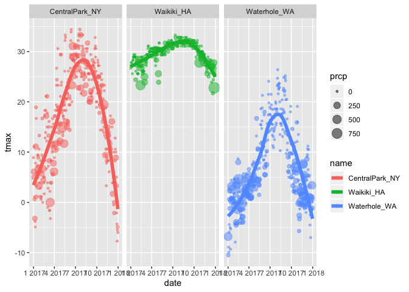

0926
================
Wurongyan Zhang
9/26/2019

``` r
library(tidyverse)
```

    ## ─ Attaching packages ────── tidyverse 1.2.1 ─

    ## ✔ ggplot2 3.2.1     ✔ purrr   0.3.2
    ## ✔ tibble  2.1.3     ✔ dplyr   0.8.3
    ## ✔ tidyr   1.0.0     ✔ stringr 1.4.0
    ## ✔ readr   1.3.1     ✔ forcats 0.4.0

    ## ─ Conflicts ──────── tidyverse_conflicts() ─
    ## ✖ dplyr::filter() masks stats::filter()
    ## ✖ dplyr::lag()    masks stats::lag()

``` r
library(ggridges)
```

    ## 
    ## Attaching package: 'ggridges'

    ## The following object is masked from 'package:ggplot2':
    ## 
    ##     scale_discrete_manual

``` r
weather_df = rnoaa::meteo_pull_monitors(c("USW00094728", "USC00519397", "USS0023B17S"),
                      var = c("PRCP", "TMIN", "TMAX"), 
                      date_min = "2017-01-01",
                      date_max = "2017-12-31") %>%
  mutate(
    name = recode(id, USW00094728 = "CentralPark_NY", 
                      USC00519397 = "Waikiki_HA",
                      USS0023B17S = "Waterhole_WA"),
    tmin = tmin / 10,
    tmax = tmax / 10) %>%
  select(name, id, everything())
```

    ## Registered S3 method overwritten by 'crul':
    ##   method                 from
    ##   as.character.form_file httr

    ## Registered S3 method overwritten by 'hoardr':
    ##   method           from
    ##   print.cache_info httr

    ## file path:          /Users/zhangwurongyan/Library/Caches/rnoaa/ghcnd/USW00094728.dly

    ## file last updated:  2019-09-03 10:49:02

    ## file min/max dates: 1869-01-01 / 2019-08-31

    ## file path:          /Users/zhangwurongyan/Library/Caches/rnoaa/ghcnd/USC00519397.dly

    ## file last updated:  2019-09-03 10:49:18

    ## file min/max dates: 1965-01-01 / 2019-08-31

    ## file path:          /Users/zhangwurongyan/Library/Caches/rnoaa/ghcnd/USS0023B17S.dly

    ## file last updated:  2019-09-03 10:49:24

    ## file min/max dates: 1999-09-01 / 2019-08-31

``` r
weather_df
```

    ## # A tibble: 1,095 x 6
    ##    name           id          date        prcp  tmax  tmin
    ##    <chr>          <chr>       <date>     <dbl> <dbl> <dbl>
    ##  1 CentralPark_NY USW00094728 2017-01-01     0   8.9   4.4
    ##  2 CentralPark_NY USW00094728 2017-01-02    53   5     2.8
    ##  3 CentralPark_NY USW00094728 2017-01-03   147   6.1   3.9
    ##  4 CentralPark_NY USW00094728 2017-01-04     0  11.1   1.1
    ##  5 CentralPark_NY USW00094728 2017-01-05     0   1.1  -2.7
    ##  6 CentralPark_NY USW00094728 2017-01-06    13   0.6  -3.8
    ##  7 CentralPark_NY USW00094728 2017-01-07    81  -3.2  -6.6
    ##  8 CentralPark_NY USW00094728 2017-01-08     0  -3.8  -8.8
    ##  9 CentralPark_NY USW00094728 2017-01-09     0  -4.9  -9.9
    ## 10 CentralPark_NY USW00094728 2017-01-10     0   7.8  -6  
    ## # … with 1,085 more rows

``` r
ggplot(weather_df, aes(x = tmin, y = tmax)) + 
  geom_point()
```

    ## Warning: Removed 15 rows containing missing values (geom_point).

<!-- -->

``` r
plot_weather = 
  weather_df %>% 
  ggplot(aes(x = tmin, y = tmax)) 

plot_weather + geom_point()
```

    ## Warning: Removed 15 rows containing missing values (geom_point).

<!-- -->

``` r
ggplot(weather_df, aes(x = tmin, y = tmax)) + 
  geom_point(aes(color = name))
```

    ## Warning: Removed 15 rows containing missing values (geom_point).

<!-- -->

``` r
ggplot(weather_df, aes(x = tmin, y = tmax)) + 
  geom_point(aes(color = name), alpha = 0.5) +
  geom_smooth(se = FALSE) +
  facet_grid(. ~ name)
```

    ## `geom_smooth()` using method = 'loess' and formula 'y ~ x'

    ## Warning: Removed 15 rows containing non-finite values (stat_smooth).

    ## Warning: Removed 15 rows containing missing values (geom_point).

<!-- -->

``` r
#alpha = transparency(0=transparent)
#se = turn CI off
#facet_grid = grid of individual panals
#.~name = name in columns
```

``` r
ggplot(weather_df, aes(x = date, y = tmax, color = name)) + 
  geom_point(aes(size = prcp), alpha = .5) +
  geom_smooth(size = 2, se = FALSE) + 
  facet_grid(. ~ name)
```

    ## `geom_smooth()` using method = 'loess' and formula 'y ~ x'

    ## Warning: Removed 3 rows containing non-finite values (stat_smooth).

    ## Warning: Removed 3 rows containing missing values (geom_point).

<!-- -->

take of geom points

``` r
ggplot(weather_df, aes(x = date, y = tmax, color = name)) + 
  geom_smooth(se = FALSE) 
```

    ## `geom_smooth()` using method = 'loess' and formula 'y ~ x'

    ## Warning: Removed 3 rows containing non-finite values (stat_smooth).

<!-- -->

geom\_hex(), geom\_bin2d(), or geom\_density2d()

``` r
ggplot(weather_df, aes(x = tmax, y = tmin)) + 
  geom_hex()
```

    ## Warning: Removed 15 rows containing non-finite values (stat_binhex).

<!-- -->

``` r
ggplot(weather_df, aes(x = tmax, y = tmin)) + 
  geom_bin2d()
```

    ## Warning: Removed 15 rows containing non-finite values (stat_bin2d).

<!-- -->

``` r
ggplot(weather_df, aes(x = tmax, y = tmin)) + 
  geom_density2d()
```

    ## Warning: Removed 15 rows containing non-finite values (stat_density2d).

<!-- -->

``` r
weather_df %>% 
  ggplot(aes(x = tmax)) + 
  geom_histogram()
```

    ## `stat_bin()` using `bins = 30`. Pick better value with `binwidth`.

    ## Warning: Removed 3 rows containing non-finite values (stat_bin).

<!-- -->

position: dodge together, next to each other

``` r
weather_df %>% 
  ggplot(aes(x = tmax, fill = name)) + 
  geom_histogram(position = "dodge", binwidth = 2)
```

    ## Warning: Removed 3 rows containing non-finite values (stat_bin).

<!-- -->

alpha: transparency adjust: it helps to try a few values. geom\_rug() :
helpful way to show the raw data in addition to the density.

``` r
ggplot(weather_df, aes(x = tmax, fill = name)) + 
  geom_density(alpha = .4, adjust = .5, color = "blue") +
  geom_rug()
```

    ## Warning: Removed 3 rows containing non-finite values (stat_density).

<!-- -->

``` r
ggplot(weather_df, aes(x = name, y = tmax)) + geom_boxplot()
```

    ## Warning: Removed 3 rows containing non-finite values (stat_boxplot).

<!-- -->

violin plot:

``` r
ggplot(weather_df, aes(x = name, y = tmax)) + 
  geom_violin(aes(fill = name), color = "blue", alpha = .5) + 
  stat_summary(fun.y = median, geom = "point", color = "blue", size = 4)
```

    ## Warning: Removed 3 rows containing non-finite values (stat_ydensity).

    ## Warning: Removed 3 rows containing non-finite values (stat_summary).

<!-- -->

ridge:

``` r
ggplot(weather_df, aes(x = tmax, y = name)) + 
  geom_density_ridges(scale = .85)
```

    ## Picking joint bandwidth of 1.84

    ## Warning: Removed 3 rows containing non-finite values (stat_density_ridges).

<!-- -->
